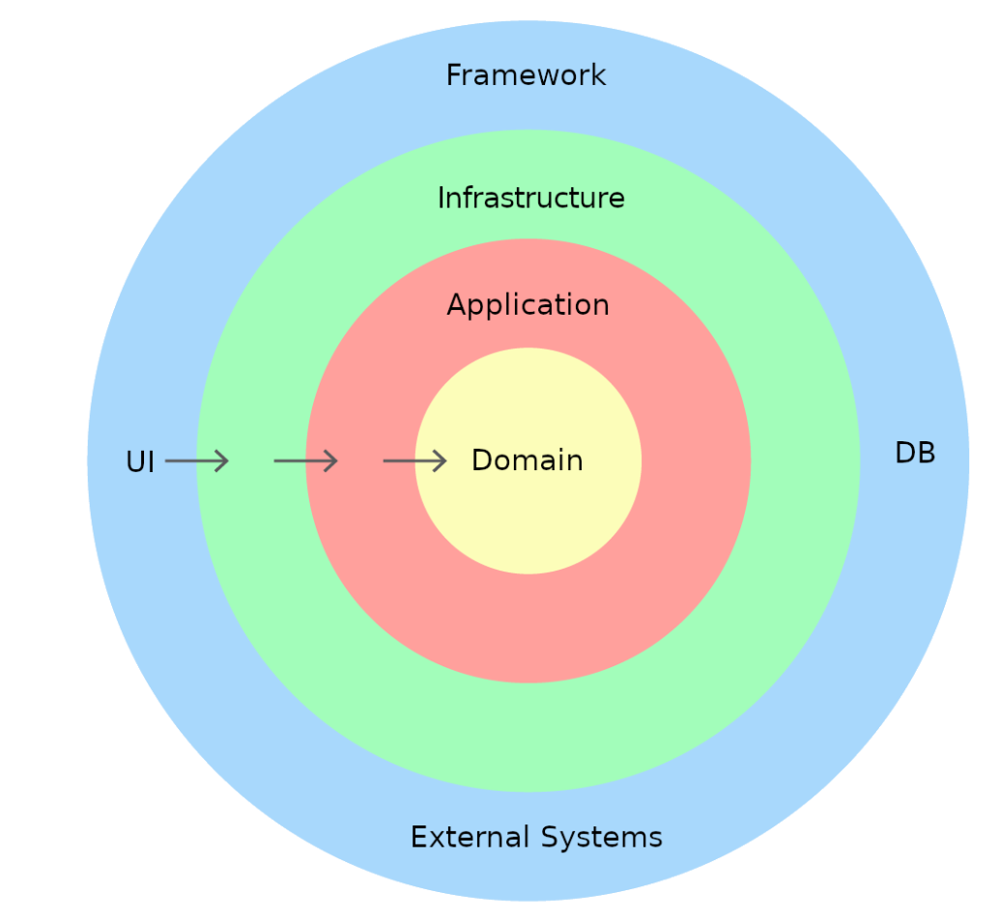
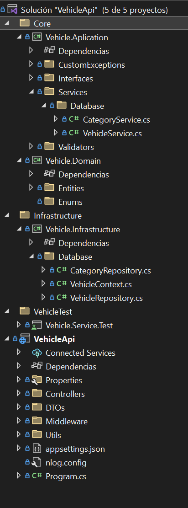

# Important

# ASP.NET Core & EntityFramework Core

This template is a simple startup project to start with ABP
using ASP.NET Core and EntityFramework Core.

## Prerequirements

* Visual Studio 2022
* .NET Core SDK
* SQL Server

## How To Run

* Open solution in Visual Studio 2022
* Set .Web project as Startup Project and build the project.
* Run the application.

The project try to follow the clean arquitectures rules.

## Clean Architecture
The concept of a Clean Architecture pattern has been around for over a decade and initially conceived by Robert Martin (better known as Uncle Bob). The keyword from Uncle Bob is Interchangeable. In the image below, everything on the blue circle is interchangeable, for e.g. the UI can be swapped out from Angular to React, or the database can be migrated from Oracle to MySQL, and nothing in the underlying layers need to change.
The concept of having all your interfaces (Infrastructure and Application) in one project, will make it easier to Unit Test and mock.
But the main rational behind Clean Architecture, is that MVC doesn’t scale or allow for the same loose coupling of the layers. In Clean Architecture, the dependency is inward facing only (this satisfies DI from SOLID principal). In MVC the Model View acts as the UI and Controller layer in one, this can get very large and difficult to test (because of the tight coupling). MVC has served the software industry for over 20 years, but the industry wants a new leaner architecture pattern, for the next 20 years – one that is scalable\interchangeable\decoupled.

### Core (Domain and Application):
The Application layer is a top layer or parent layer (of the core) which only depends on Domain layer. Other layers like Infrastructure or UI will depend on Application.
Application contains 'Interfaces', 'Business Logic', etc.
The Domain project mostly contains 'Entities', Custom Exceptions, Enumerations etc. 

### Infrastructure:
Infrastructure deals with 'Databases', 'External API Calls', 'Cache', etc. Basically, infrastructure deals with all external resources. Infrastructure depends on the 'Interface' inside of Application. Because of the dependency inversion, our Application will be loosely coupled, which makes it easy to test.

### UI Application:
UI Application consumes the 'Application Core' to produce the results. In a real-time scenario UI Application never depends on the infrastructure layer, but we have to reference the infrastructure layer into the UI project in the case to register the services dependency injection. So UI project should not use any code of the infrastructure layer other than dependency injection.

### Folder Structure:

